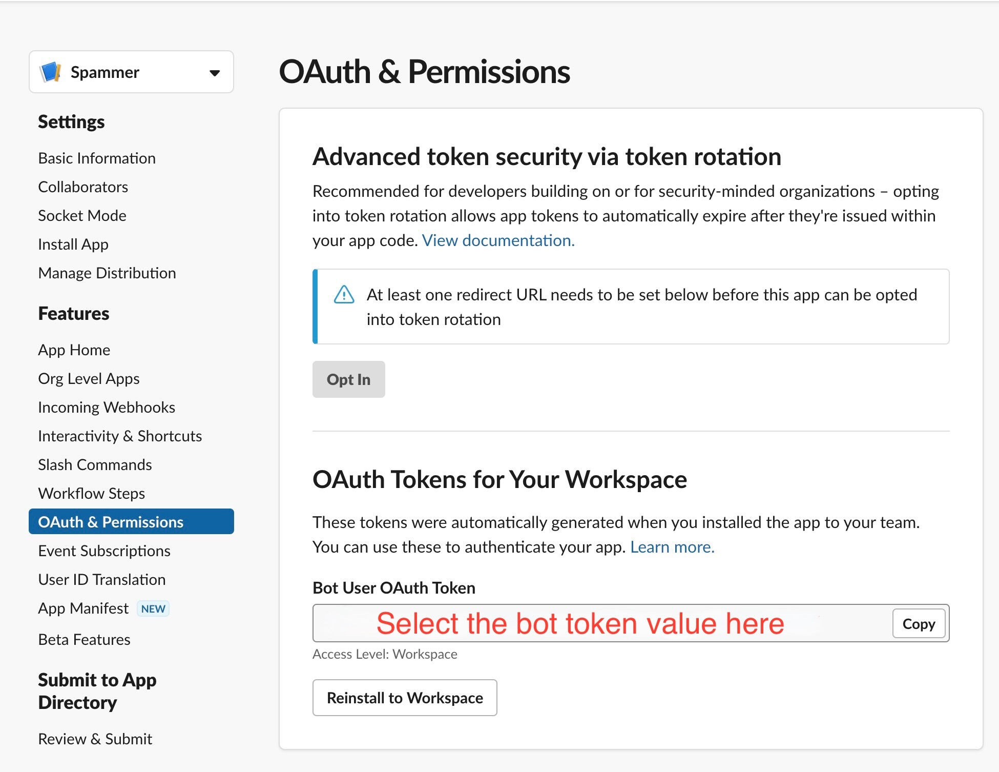

# slack-alert

A lightweight microservice that sends a slack notification for spam payloads.

## Description

The service runs a [Ruby on Rails](https://rubyonrails.org/) server.

Slack notifications are sent using the [Slack Ruby client](https://github.com/slack-ruby/slack-ruby-client) and requires a [Slack Bot token](https://api.slack.com/authentication/token-types#bot) to be configured correctly.

Notification tasks are automatically enqueued to [Sidekiq](https://sidekiq.org) as Rails [ActiveJobs](https://edgeguides.rubyonrails.org/active_job_basics.html)

### Slack Bot Token

1) Navigate to your Slack apps directory: https://api.slack.com/apps
2) Create or select an existing app.
3) Find the `Bot User OAuth Token` under the "OAuth & Permissions" tab on the left menu.



Finally, expose the above bot token in your current environment and ensure your workspace has a channel with the name specified in [config.py](./alert/config.py)

```bash
$ export SLACK_BOT_TOKEN='xoxb-<your>-<bot>-<token>'
```

## Development

1) Launch the Rails server.
    ```bash
    $ bin/rails server -p 5050

    => Booting Puma
    => Rails 7.0.4.2 application starting in development
    => Run `bin/rails server --help` for more startup options
    Puma starting in single mode...
    * Puma version: 5.6.5 (ruby 3.0.0-p0) ("Birdie's Version")
    *  Min threads: 5
    *  Max threads: 5
    *  Environment: development
    *          PID: 11569
    * Listening on http://127.0.0.1:5050
    * Listening on http://[::1]:5050
    Use Ctrl-C to stop
    ```

2) Make reqeusts to the API server using any HTTP client. For eg;
    ```bash
    $ curl -X POST http://127.0.0.1:5050/bounce/notify -H "Content-Type: application/json" -d '{"RecordType": "Bounce", "Type": "SpamNotification", "TypeCode": 512, "Name": "Spam notification", "Tag": "", "MessageStream": "outbound", "Description": "The message was delivered, but was either blocked by the user, or classified as spam, bulk mail, or had rejected content.", "Email": "zaphod@example.com", "From": "notifications@honeybadger.io", "BouncedAt": "2023-02-27T21:41:30Z"}' | jq .

    % Total    % Received % Xferd  Average Speed   Time    Time     Time  Current
                                    Dload  Upload   Total   Spent    Left  Speed
    100   624    0   238  100   386    374    607 --:--:-- --:--:-- --:--:--   990
    {
        "Type": "SpamNotification",
        "Email": "zaphod@example.com",
        "BouncedAt": "2023-02-27T21:41:30Z",
        "Description": "The message was delivered, but was either blocked by the user, or classified as spam, bulk mail, or had rejected content.",
        "Tag": ""
    }
    ```

### Running tests
```bash
$ bin/rails test

Running 3 tests in a single process (parallelization threshold is 50)
Run options: --seed 44992

# Running:


Failed to parse request payload,
Exception: 809: unexpected token at ''
Failed to parse request payload, foo=bar&bar=baz&error&success
Exception: 809: unexpected token at 'foo=bar&bar=baz&error&success'...

Finished in 0.605645s, 4.9534 runs/s, 6.6045 assertions/s.
3 runs, 4 assertions, 0 failures, 0 errors, 0 skips
```

## TODO
- [Asynchronous task execution](https://github.com/tinvaan/slack-alert/issues/7)
- [ActiveJob task unit tests](https://github.com/tinvaan/slack-alert/issues/11)
- [Mock Slack API calls from unit tests](https://github.com/tinvaan/slack-alert/issues/12)
- [Containerize the service](https://github.com/tinvaan/slack-alert/issues/8)
- [Automated deployments](https://github.com/tinvaan/slack-alert/issues/9)
- [Generate test coverage reports](https://github.com/tinvaan/slack-alert/issues/10)